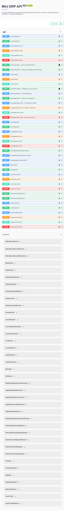

# Mini ERP Backend API

## 1. Project Title and Description
**Mini ERP Backend API** is a modular Django REST Framework system for:
- Account authentication (register, login, logout, profile)
- HR management (departments, positions, employees)
- Leave management (request, approve, reject)
- Attendance management (attendance records)

It also provides OpenAPI schema generation and interactive API docs through Swagger UI.

## 2. Technologies Used
- Python 3.13
- Django 4.2.29
- Django REST Framework 3.15.2
- drf-spectacular 0.27.2 (OpenAPI + Swagger)
- django-filter 23.5
- SQLite (default, for local development)
- python-decouple 3.8

## 3. Setup Instructions
1. Clone the repository and move into the project folder:
```bash
git clone https://github.com/Temesgenf/mini-erp-backend
cd mini_erp
```

2. Create and activate a virtual environment:
```bash
python -m venv erp_env
# Windows
erp_env\Scripts\activate
# macOS/Linux
source erp_env/bin/activate
```

3. Install dependencies:
```bash
pip install -r requirements.txt
```

4. Apply database migrations:
```bash
python manage.py makemigrations
python manage.py migrate
```

5. (Optional) Create an admin user:
```bash
python manage.py createsuperuser
```

## 4. Running the Server
```bash
python manage.py runserver
```

Default local URL: `http://127.0.0.1:8000/`

## 5. API Endpoint List
Base URL: `http://127.0.0.1:8000/api/`

| Module | Method | Endpoint | Description | Auth |
|---|---|---|---|---|
| Accounts | POST | `/api/auth/register/` | Register new user and return token | No |
| Accounts | POST | `/api/auth/login/` | Login and return token | No |
| Accounts | POST | `/api/auth/logout/` | Logout (delete token) | Yes |
| Accounts | GET, PATCH, PUT | `/api/auth/me/` | Current user profile | Yes |
| HR | GET, POST | `/api/departments/` | List/Create departments | Yes |
| HR | GET, PUT, PATCH, DELETE | `/api/departments/{id}/` | Retrieve/Update/Delete department | Yes |
| HR | GET, POST | `/api/positions/` | List/Create positions | Yes |
| HR | GET, PUT, PATCH, DELETE | `/api/positions/{id}/` | Retrieve/Update/Delete position | Yes |
| HR | GET, POST | `/api/employees/` | List/Create employees | Yes |
| HR | GET, PUT, PATCH, DELETE | `/api/employees/{id}/` | Retrieve/Update/Delete employee | Yes |
| HR | GET | `/api/employees/{id}/profile/` | Employee full profile | Yes |
| HR | GET | `/api/employees/{id}/direct_reports/` | Employee direct reports | Yes |
| HR | POST | `/api/employees/{id}/deactivate/` | Deactivate employee | Yes |
| Leave | GET, POST | `/api/leaves/` | List/Create leave requests | Yes |
| Leave | GET, PUT, PATCH, DELETE | `/api/leaves/{id}/` | Retrieve/Update/Delete leave request | Yes |
| Leave | POST | `/api/leaves/{id}/approve/` | Approve leave request | Yes |
| Leave | POST | `/api/leaves/{id}/reject/` | Reject leave request | Yes |
| Attendance | GET, POST | `/api/attendance/` | List/Create attendance records | Yes |
| Attendance | GET, PUT, PATCH, DELETE | `/api/attendance/{id}/` | Retrieve/Update/Delete attendance record | Yes |
| Docs | GET | `/api/schema/` | OpenAPI schema | No |
| Docs | GET | `/api/docs/` | Swagger UI | No |
| Docs | GET | `/api/redoc/` | ReDoc UI | No |

## 6. Running Tests
Run all tests:
```bash
python manage.py test
```

Run only API tests:
```bash
python manage.py test tests.test_api
```

## 7. Swagger Screenshot
Swagger UI: `http://127.0.0.1:8000/api/docs/`

## 8. Environment Variables
Create a `.env` file in the project root.

You can start quickly by copying the template:
```bash
copy .env.example .env
```

| Key | Example | Purpose |
|---|---|---|
| `SECRET_KEY` | `django-insecure-change-me` | Django secret key |
| `DEBUG` | `True` | Development debug mode |
| `ALLOWED_HOSTS` | `127.0.0.1,localhost` | Allowed hostnames |

Note: current local setup works with the default SQLite settings in `config/settings.py`.

## 9. Author
- Temesgen Fikadu
- Email: `tamasgenfiqaadu@gmail.com`
